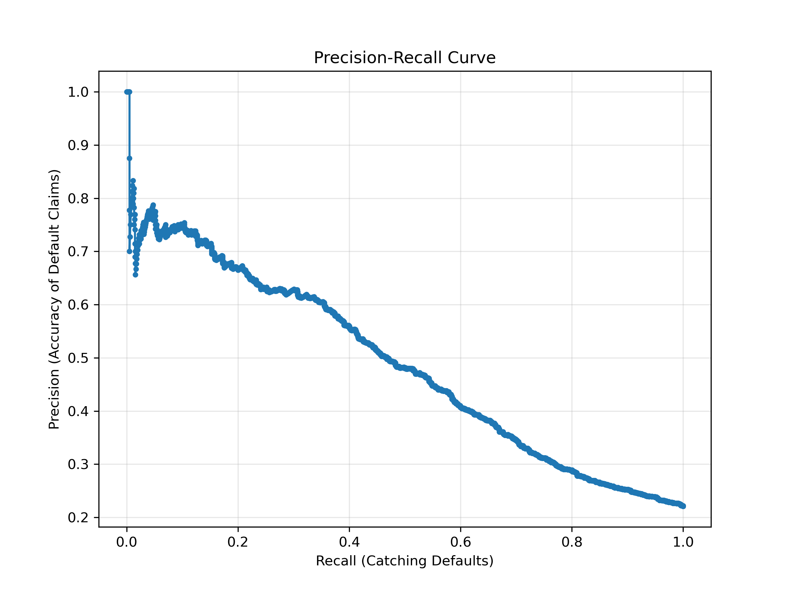
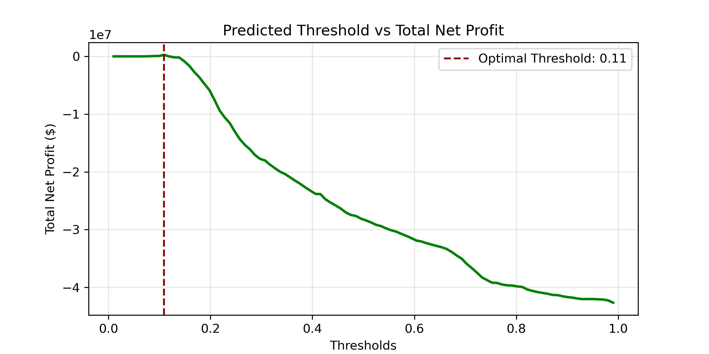

# 🏦 Profit-Driven Credit Risk Engine


Most machine learning models optimize for standard metrics like accuracy. This project optimizes for **corporate net profit**. 

This repository contains a full-stack risk management application. The core prediction engine is a **custom Logistic Regression model built entirely from scratch using NumPy**, designed to identify credit card defaulters. By abandoning standard accuracy (which is a dangerous metric for imbalanced financial datasets) and directly integrating a business cost/profit matrix into the model's threshold optimization, this engine maximizes revenue while protecting the vault.

## ⚠️ The Business Problem: Accuracy is a Trap

In credit lending, mistakes have asymmetric costs.
* **False Positive (Rejecting a good customer):** The bank loses the opportunity to earn interest. Estimated opportunity cost: **+$5,000**.
* **False Negative (Approving a defaulter):** The bank loses the principal amount. Estimated direct loss: **-$50,000**.

Because our dataset is highly imbalanced (78% good customers, 22% defaulters), a "dumb" model that simply approves everyone would achieve a technically impressive **78% accuracy**—and immediately bankrupt the institution. 

This engine solves this by outputting unweighted, brutally honest probabilities, and using a custom optimization loop to find the exact classification threshold that maximizes total net profit.

---

## 🧠 Architecture & Math Under the Hood

To maintain absolute control over the mathematical architecture, we bypassed standard libraries like `scikit-learn` for the core model and built the engine from scratch.

* **Binary Cross-Entropy (Log Loss):** Used to calculate the distance between predicted probabilities and actual outcomes.
* **L2 Regularization (Ridge):** Implemented a penalty term ($\lambda$) to constrain feature weights and prevent the model from overfitting to the training data.
* **No Class Weights:** We deliberately avoided class weights during training to prevent artificial warping of the output probabilities, ensuring a 20% predicted risk maps exactly to a real-world 20% default rate.
* **Profit-Optimized Threshold (0.11):** Instead of using a standard `0.50` decision boundary, the system dynamically calculates the threshold that balances the $50,000 fear of default against the $5,000 greed for interest. The mathematical tipping point is exactly **11%**.

---

## 📊 Results & Metrics

### 1. Model Calibration (Is it honest?)
Before applying business rules, the model must output reliable probabilities. The Calibration Curve below shows that our custom NumPy engine hugs the diagonal reality line perfectly.


*(A predicted 40% risk translates cleanly to a 40% real-world default rate).*

### 2. The Precision-Recall Trade-off
Because we are hunting for the minority class (defaulters), this curve visualizes the friction between catching every bad actor (Recall) and falsely rejecting good customers (Precision).



### 3. The Grand Finale: Optimizing for Profit
This graph proves the business value of the model. By simulating the financial matrix across every possible threshold from 0.01 to 0.99, we found the exact peak of profitability. At a **0.11 threshold**, the bank maximizes interest generation while successfully blocking catastrophic defaults.



---

## 💻 Tech Stack & Project Structure

* **Core Engine:** Pure Python / NumPy (Custom ML architecture)
* **Backend API:** FastAPI (Uvicorn server)
* **Frontend UI:** Streamlit (Interactive dashboard for loan officers)

---

## 🚀 How to Run Locally

To spin up both the API and the UI on your local machine, you will need two terminal windows.

**1. Start the FastAPI Backend:**
Open your terminal and run the Uvicorn server to host the prediction API.

```bash
uvicorn main:app --reload

```

*The API will be available at `http://127.0.0.1:8000*`

**2. Start the Streamlit Frontend:**
Open a second terminal window and launch the interactive dashboard.

```bash
streamlit run app.py

```

*Your browser will automatically open to `http://localhost:8501*`

---

*Built to bridge the gap between mathematical theory and enterprise profitability.*

```

```
